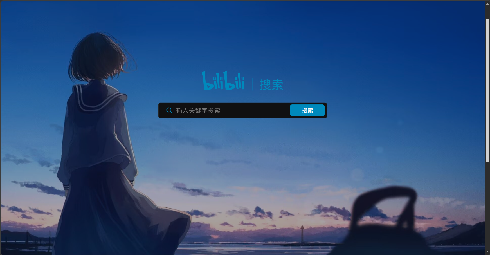
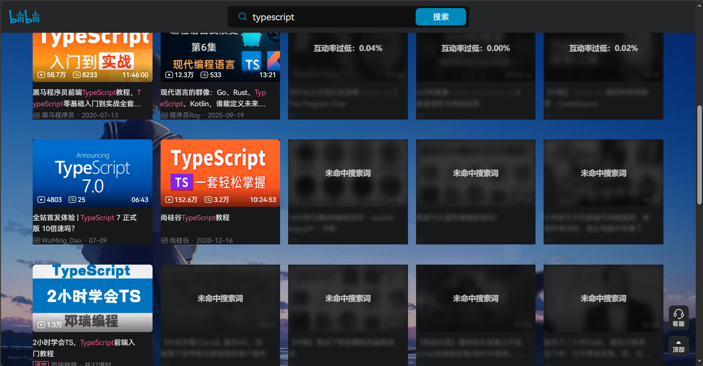

# BiliManager

BiliManager 是一个基于 Manifest V3 的 Bilibili 浏览器扩展，使用 React、TypeScript、Tailwind CSS 和 Vite 构建。

## 功能

### 主题与背景：

支持浅色、深色和跟随系统主题，并可设置自定义背景（黑白遮罩会跟随系统主题）



### 搜索结果过滤：

按标题规则，UP 昵称（自定义正则表达式），互动率，模糊或降权视频。



### 播放页个性化：

隐藏相关推荐、播放器广告，并控制相关推荐自动播放。
记录每日观看时长和最近观看视频。
（只要视频在播放，没有被最小化，都是可以加入统计的~）

数据同步：在扩展设置页导入或导出配置和观看历史，方便备份或迁移到另一台设备。

## 数据同步

打开扩展设置页的“数据管理”区域，可以使用“导入”和“导出”功能。

### 导出

- **设置配置**：功能开关、过滤规则、观看计时设置和主题等配置。
- **观看历史**：每日观看时长和最近观看视频记录。

### 导入

点击“导入”并选择之前导出的 JSON 文件即可恢复数据。导入全部数据或设置配置时，会保留当前设备上的自定义背景图片；导入观看历史时会替换当前已保存的观看历史。

导入前建议先导出当前数据作为备份。纯文本内容会按换行分隔，作为标题过滤规则导入。

## 开发与构建

```bash
npm install
npm run check
npm run build
```

构建完成后，在 Chrome 或 Edge 的扩展管理页面开启“开发者模式”，选择“加载已解压的扩展程序”，并载入生成的 `dist/` 目录。
