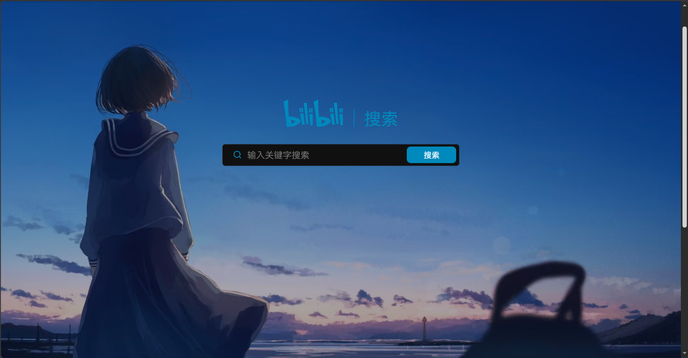
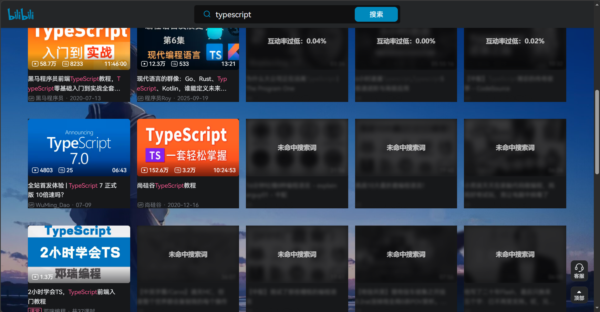

<p align="center">
  
</p>

<h1 align="center">BiliManager</h1>

<p align="center">
  面向 Bilibili 的本地管理与浏览体验优化扩展
</p>

<p align="center">
  少一点干扰，多一点专注&nbsp;&nbsp;( •̀ ω •́ )✧
</p>

<p align="center">
  Manifest V3 · React · TypeScript · Tailwind CSS · Vite
</p>

## ✨ 功能概览

### 🎨 主题与背景

支持浅色、深色和跟随系统主题，并可设置自定义背景。黑白遮罩会跟随系统主题自动调整。

<p align="center">
  
</p>

### 🔎 搜索结果过滤

根据标题规则、UP 主昵称、自定义正则表达式、播放量下限和互动率筛选搜索结果，并可对不需要的视频进行模糊或降权处理。也可以隐藏搜索页热榜，减少搜索过程中的额外干扰。

<p align="center">
  
</p>

### 🚫 UP 主拦截与收藏夹推荐

在搜索结果中可以直接屏蔽指定 UP 主。命中过滤规则的卡片支持使用收藏夹视频替换，避免搜索页留下大片空白结果。（演示将灰色遮罩根据 fid 参数随机放入收藏夹视频，并给出提示，也许可以替换为知识收藏夹，翻出正在吃灰的视频www）

<p align="center">
  
</p>

### 📺 播放页个性化

- 隐藏播放页中不需要的内容
- 记住相关推荐的自动播放开关
- 进入播放页时支持默认关闭弹幕
- 记录每日观看时长与最近观看视频
- 点击统计图查看当天观看视频时长 Top 3
- 支持计时器透明度、位置配置和定时休息提醒

视频处于播放状态且页面没有被最小化时，观看时长会加入统计。

### 💾 数据导入与导出

扩展设置页提供数据管理功能，方便备份配置和观看记录，或迁移到另一台设备。

- **设置配置**：功能开关、过滤规则、观看计时设置和主题等配置
- **观看历史**：每日观看时长和最近观看视频记录

导入全部数据或设置配置时，会保留当前设备上的自定义背景图片；导入观看历史时，会替换当前已保存的观看历史。导入前建议先导出当前数据作为备份。

纯文本内容会按换行分隔，并作为标题过滤规则导入。

## 🔐 隐私说明

> 数据留在本地，不上传给开发者或第三方

BiliManager 的设置与观看记录保存在当前浏览器配置文件中扩展专属的 `chrome.storage.local`。扩展不使用 `chrome.storage.sync`，不会通过浏览器账号同步这些数据。

- **设置配置**：保存功能开关、过滤规则、主题、定时器参数与位置，以及用户选择的自定义背景图片数据
- **观看记录**：启用定时器后，保存播放日期、观看时长、页面标识、视频标题、视频 URL 和记录更新时间
- **临时计时状态**：保存当前播放页的计时进度，便于页面刷新或短暂中断后继续统计；超过 12 小时的临时状态不会继续使用
- **搜索页内容**：读取标题、UP 主名称、播放量与弹幕量以执行本地过滤，但不会把搜索结果保存为观看历史

观看历史最多保留 370 天，并限制为 5000 条索引记录；最近观看列表最多保留 100 个视频。用户可以在设置页导出或替换观看历史。卸载扩展时，浏览器通常会一并删除该扩展的本地存储。

## 🚀 开发与构建

```bash
npm install
npm run check
npm run build
```

构建完成后，在 Chrome 或 Edge 的扩展管理页面开启“开发者模式”，选择“加载已解压的扩展程序”，并载入生成的 `dist/` 目录。

## 使用方法

### 从 Release 安装

1. 打开 [BiliManager Releases](https://github.com/Ita-Hloks/BiliManager/releases)，进入最新版本页面
2. 在 **Assets** 中下载 `BiliManager_v版本号.zip`
3. 将下载的压缩包解压到一个固定目录，例如 `D:\Extensions\BiliManager\v0.2.1`。

### 在 Chrome, Edge 中加载

1. 在地址栏打开 `chrome://extensions/` 或 `edge://extensions/`
2. 开启“开发者模式”。
3. 点击“加载已解压的扩展程序”。
4. 选择刚才解压后的 BiliManager 目录，也就是包含 `manifest.json` 的目录。
5. 加载完成后，可以在浏览器扩展按钮中固定 BiliManager，并打开 Bilibili 页面检查功能是否生效。
